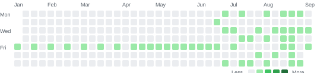

## 输出节奏

这张图把从 2026 年 1 月到现在的所有文章按天铺开。每个格子代表一天,颜色越深代表那天输出的文章越多。

目前累计写了 **51** 篇文章,大概维持着 **5.7 篇/月** 的节奏——既不算高强度,也不是低产,更像是一种持续的、技术读书笔记式的输出。

  
累计输出

  
GitHub 风格的日输出热力图 · 时间段:2026-01-08 → 2026-09-10

  

    
  

  

    <b>51</b> 篇总数
    <b>9</b> 个月
    <b>5.7</b> 篇/月均
    <b>51</b> 天有输出
  

## 文章时间轴

  
📅 202651 篇

  
9 月

  

    09-10
    善待自己是一剂不保证有效的药方 — 听程乐松讲
    哲学
  

  

    09-08
    听《十字路口》刘震云那一期,我突然不焦虑了——一个普通人的几个共鸣
    哲学
  

  

    09-05
    关于"内卷"的经济学解释——读《人月神话》和薛兆丰之后
    经济学
  

  

    09-01
    不确定性是人生唯一确定的事——三十岁后我不再假装掌控一切
    哲学
  

  
8 月

  

    08-30
    为什么我不再相信"自由市场万能"——读《资本主义与自由》之后
    经济学
  

  

    08-29
    RAG 评估体系——怎么知道你的 RAG 系统好不好
    AI
  

  

    08-28
    三十岁后我开始理解"放下"——一些不那么好听的真话
    哲学
  

  

    08-27
    LLM 部署优化——vLLM、TGI、SGLang 三大推理框架实测
    AI
  

  

    08-26
    AI 工作流自动化——n8n + LLM 实战
    AI
  

  

    08-25
    道德经里那段让我半夜睡不着的话
    哲学
  

  

    08-23
    MCP(Model Context Protocol)实战——AI 工具集成的新标准
    AI
  

  

    08-20
    三十岁后重读"知行合一"——王阳明对我这十年的影响
    哲学
  

  

    08-19
    Cursor vs Claude Code vs Copilot——AI 编程助手横评
    AI
  

  

    08-18
    向量数据库横评——Chroma、Milvus、Qdrant、Weaviate 怎么选
    AI
  

  

    08-16
    GraphRAG 实战——用知识图谱增强 RAG 检索
    AI
  

  

    08-14
    RAG 进阶——HyDE、Self-RAG、CRAG 三种增强检索实战
    AI
  

  

    08-11
    Dify vs Coze vs FastGPT——AI 应用编排平台横评
    AI
  

  

    08-08
    LlamaIndex vs LangChain——两个框架的真正区别
    AI
  

  

    08-05
    Agent 记忆系统——短期、长期、向量、图四种记忆怎么选
    AI
  

  

    08-02
    Agent 工具调用可靠性——为什么 70% 的工具调用会失败
    AI
  

  
7 月

  

    07-31
    Multi-Agent 协作——CrewAI、MetaGPT、AutoGen 三种框架实测
    AI
  

  

    07-28
    AutoGPT / BabyAGI 类自主 Agent——概念很美,落地很难
    AI
  

  

    07-25
    LangGraph 实战——有状态 Agent 的正确打开方式
    AI
  

  

    07-22
    Agent 架构模式——ReAct、Plan-and-Execute、Reflection 三大范式实战对比
    AI
  

  

    07-18
    模型蒸馏 vs 微调——两个 80 分,一个 120 分
    AI
  

  

    07-15
    长上下文窗口——100K、200K、1M Token 背后的工程难题
    AI
  

  

    07-12
    Prompt Engineering 进阶——CoT、ReAct、Reflexion 三种范式
    AI
  

  

    07-09
    Function Calling / Tool Use 协议详解——从 JSON Schema 到多轮调用
    AI
  

  

    07-07
    Token 经济学——为什么 API 调用这么贵
    AI
  

  

    07-04
    主流大模型横评——我用 6 个模型做同一道题的实测
    AI
  

  
6 月

  

    06-30
    气量智能问数：Text-to-SQL 的落地实践
    AI
  

  

    06-28
    从传统后端到 AI 工程化：我的六年踩坑复盘
    AI
  

  

    06-25
    Dify 编排企业级 Workflow
    AI
  

  

    06-22
    YOLOv5 目标检测训练完整实践
    AI
  

  

    06-18
    LangChain Agent 实战：从原理到落地
    AI
  

  

    06-11
    RAG 知识库工程化实践
    AI
  

  

    06-04
    从 .NET 单体到 Java 微服务的迁移实践
    Architecture
  

  
5 月

  

    05-28
    大模型应用开发基础：API 调用与工程封装
    AI
  

  

    05-21
    Go + KVM/libvirt 实现虚拟机管理
    Go
  

  

    05-14
    Go 并发编程：goroutine 与 channel
    Go
  

  

    05-07
    Kubernetes 入门与生产实践
    Cloud
  

  
4 月

  

    04-30
    K3s NodePort 为什么只有一个节点能访问
    Troubleshooting
  

  

    04-23
    海量轨迹数据存储与分区优化
    Database
  

  

    04-16
    PostgreSQL + PostGIS 地理数据实践
    Database
  

  

    04-02
    K3s 轻量级集群搭建与踩坑
    Cloud
  

  
3 月

  

    03-19
    MySQL 索引优化实战
    Database
  

  

    03-05
    一个定时任务从 14 分钟优化到 2 分钟
    Java
  

  
2 月

  

    02-19
    企业级微服务基础平台设计
    Architecture
  

  

    02-05
    Docker 从入门到生产实践
    Cloud
  

  
1 月

  

    01-22
    Spring Cloud 微服务架构演进
    Java
  

  

    01-08
    从单体架构迁移到微服务，我是怎么设计的
    Architecture
  

  想读全文请到 <a href="/archives/">技术文章</a> 页面,按时间倒序完整列表;也可以从 <a href="/categories/">分类</a> / <a href="/tags/">标签</a> 维度浏览。

